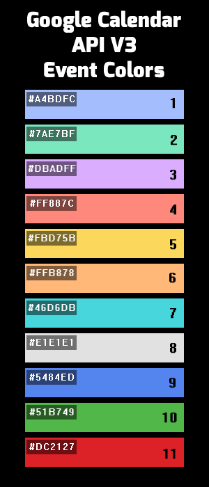

### Import-SSU-schedule-to-Google-Calendar

##### Requirements:

* google-api-python lib
    * For install: `pip install --upgrade google-api-python-client`
* Python 3.5 or greater

##### How to use it:

* First of all you should generate `client_secret.json` for it read `Step 1: Turn on the Google Calendar API`  [HERE](https://developers.google.com/google-apps/calendar/quickstart/python). 
* Put json file to folder with this scripts
* run `main.py`
   * when main.py will running you are able to see: 
      * `[INFO] Event created: LINK1`
      * `[INFO] Event created: LINK2`
      * `...`
   * The schedule will be added starting next Monday.
   

### Configuration:
* All settings are in `configs.json`

* Config parameters:
    * `"study_mode"` : can be `do` or `zo`
    * `"department"` : your study department 
    * `"group"` : your study group 

    * Colors parameters like `color.lesson`: You can get color code below(in image). If field is empty will be used `color.default` parameter.
        * examples:
            * `"color.lesson": "5"`
            * `"color.laboratory_work": "9"`
    
    * Specializations: If you have extra subjects you can include them to your calendar by `"include.specializations"`
        * examples:
            * `"include.specializations": "1-C web-дизайн"`
            * `"include.specializations": "перев. 2"`
    
    * Calendar parameters:
        * `"personal_email"` : your personal email which will be added to event. Can be empty.
        * `"recurrence"` : 
            * example on two weeks `"RRULE:FREQ=WEEKLY;COUNT=2"`
        * `"timezone"`
            * by default used `UTC+4` timezone (`"Europe/Samara"`)

        * `"calendarId"` : calendar for using.
            * by default used `"primary"` which is `your_email@gmail.com` calendar
            * instruction how get `calendarId` [here](https://docs.simplecalendar.io/find-google-calendar-id/)

        * `"reminders.useDefault"` : default google reminders. Can be `True/False`.
        * `"reminder.popup"` : popup behind N minutes
            * example: `"reminder.popup": "20"`
        
   
#### Appendix

